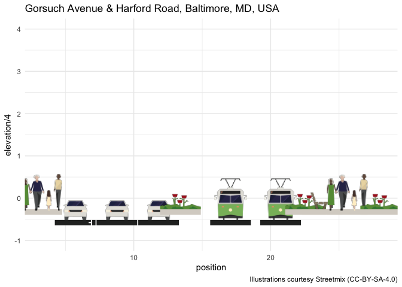

<!-- README.md is generated from README.Rmd. Please edit that file -->

# streetmixr

<!-- badges: start -->

[](https://lifecycle.r-lib.org/articles/stages.html#experimental)

<!-- badges: end -->

The goal of streetmixr is to provide access to the Streetmix API.
Streetmix uses [the Axios
library](https://docs.streetmix.net/contributing/code/reference/helpers)
to support the following:

-   getStreet,
-   deleteStreetImage
-   getGalleryForUser
-   getGalleryForAllStreets
-   getSentimentSurveyStreet
-   postSentimentSurveyVote
-   putSentimentSurveyComment

The get\_streets function supports getStreet, getGalleryForUser, and
getGalleryForAllStreets.

This package also provides an index of the [Streetmix
illustrations](https://github.com/streetmix/illustrations/) available
under a [CC-BY-SA
license](https://github.com/streetmix/illustrations/blob/main/LICENSE).
I also hope to develop some utility functions to support visualization
of street segment data and add them to this package in the future.

## Installation

You can install the development version of streetmixr like so:

``` r
# remotes::install_github("elipousson/streetmixr")
```

## Example

``` r
library(dplyr)
library(ggplot2)
library(streetmixr)
## basic example code
```

The `get_street` function allows you to download data on a street using
a Streetmix url:

``` r
# Get data on Streetmix street
street <-
  get_street(
    url = "https://streetmix.net/eli.pousson/6/harford-road-south-of-gorsuch-avenue-1950s",
    return = "street")
```

The segment data for a street can be analyzed or plotted, as this
example shows:

``` r
# Example showing plot based on segment width
street$segments |>
  group_by(type) |>
  summarise(
    pct_width = sum(width) / street$width
  ) |>
  ggplot() +
  geom_col(aes(x = type, y = pct_width)) +
  scale_y_continuous(labels = scales::label_percent()) +
  coord_flip() +
  theme_minimal(base_size = 14)
```


This data can also be combined with the illustration. This example uses
the [{ggsvg} package](https://github.com/coolbutuseless/ggsvg) to
display the illustrations in their approximate positions:

``` r
street$segments |> 
  left_join(illustrations, by = c("type" = "name")) |> 
  mutate(
    position = cumsum(width)
  ) |> 
  ggplot() +
  ggsvg::geom_point_svg(
    mapping = aes(x = position, y = 0, svg = url), size = 18
  ) +
  labs(
    title = street$location$label,
    caption = "Illustrations courtesy Streetmix (CC-BY-SA-4.0)"
  ) +
  theme_minimal()
```



You can also get streets by user id or download a selection of recent
streets using the \`count\` parameter:

``` r
get_street(user_id = "eli.pousson")$streets |> 
  select(-c(creatorIp, data)) |> 
  knitr::kable()
```

| id                                   | namespacedId | status | name                                         | creatorId   | originalStreetId                     | clientUpdatedAt          | createdAt                | updatedAt                |
|:-------------------------------------|-------------:|:-------|:---------------------------------------------|:------------|:-------------------------------------|:-------------------------|:-------------------------|:-------------------------|
| 587bc700-3159-11ec-896a-75aec116883c |            6 | ACTIVE | Harford Road south of Gorsuch Avenue (1950s) | eli.pousson | 32bfe550-3159-11ec-896a-75aec116883c | 2021-10-20T03:58:55.769Z | 2021-10-20T03:53:54.809Z | 2021-10-20T03:58:56.384Z |
| 32bfe550-3159-11ec-896a-75aec116883c |            5 | ACTIVE | Harford Road south of Gorsuch Avenue         | eli.pousson | 018fb100-3158-11ec-896a-75aec116883c | 2021-10-20T03:52:28.031Z | 2021-10-20T03:52:51.511Z | 2021-10-20T03:52:51.654Z |
| 7e06c6b0-4793-11eb-a7cc-b5a263b6bae7 |            4 | ACTIVE | NA                                           | eli.pousson | 0f21bd30-90d3-11ea-946a-abc0544fc0fc | 2020-05-08T02:23:59.740Z | 2020-12-26T16:00:36.548Z | 2020-12-26T16:00:37.959Z |
| 46ce4c10-918e-11ea-98a3-a330b250095e |            3 | ACTIVE | NA                                           | eli.pousson | NA                                   | 2020-05-09T00:44:42.367Z | 2020-05-09T00:44:44.793Z | 2020-05-09T00:44:45.273Z |
| 88ee8bf0-90d5-11ea-946a-abc0544fc0fc |            2 | ACTIVE | Greenmount Avenue at E. 25th Street          | eli.pousson | 41428880-90d3-11ea-946a-abc0544fc0fc | 2020-05-09T00:33:43.827Z | 2020-05-08T02:42:18.875Z | 2020-05-09T00:33:46.378Z |
| 33f06dd0-90d5-11ea-946a-abc0544fc0fc |            1 | ACTIVE | NA                                           | eli.pousson | 0f21bd30-90d3-11ea-946a-abc0544fc0fc | 2020-05-08T02:23:59.740Z | 2020-05-08T02:39:56.252Z | 2020-05-08T02:39:56.842Z |

Issues, pull requests, or feedback are all welcome. Please consider
supporting the Streetmix project [on
OpenCollective](https://opencollective.com/streetmix) or by signing up
for the new [Streetmix+ subscription
service](https://docs.streetmix.net/user-guide/streetmix-plus/).
